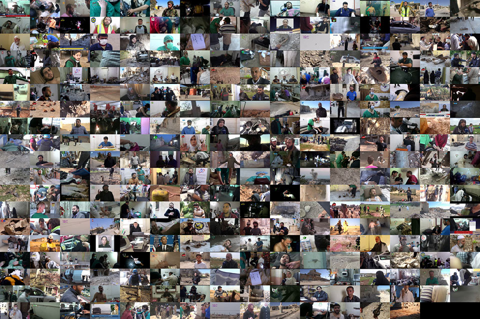

# Collaborations

## Tech 4 Tracing

VFRAME partners with [Tech 4 Tracing](https://tech4tracing.org/) to gain insight and expertise into the munitions used in conflict zones in order to create 3D models and capture sample data for developing and enhancing computer vision object detection technologies.

[Tech 4 Tracing](https://tech4tracing.org/) (T4T) is an international, US-based non-profit working towards building partnerships with human rights investigation communities to enhance and improve their abilities to understand and address illicit arms flows, bring perpetrators of armed violence to justice, and contribute to safer societies.

**Collaboration Updates**
- *Aug 17, 2022: T4T dispatches [policy brief (PDF)](https://tech4tracing.org/wp-content/uploads/2022/08/T4T-PolicyBrief1-Aug2022.pdf)  on using new technology for illicit arms control*
- *July 20, 2022: Live demo of the 9N235/210 detector added to https://modelzoo.vframe.io*
- *July 15, 2022: New 9N235 detector test videos added (bottom of page)*
- *June 29, 2022:* VFRAME presents the 9N235/210 submunition at the UN headquarters in NYC along with the 3D printed training replica at BMS8
- Website: [Tech4Tracing.org](https://tech4tracing.org/)

---

## Syrian Archive

The Syrian Archive is a Syrian-led and initiated collective of human rights activists dedicated to curating visual documentation relating to human rights violations and other crimes committed by all sides during the conflict in Syria with the goal of creating an evidence-based tool for reporting, advocacy and accountability purposes.

VFRAME has partnered extensively with the Syrian Archive to bring understanding to the massive corpus of video they have amassed.

* Websites: [Mnemonic.org](https://mnemonic.org), [SyrianArchive.org](https://syrianarchive.org/en), [YemeniArchive.org](https://yemeniarchive.org/en)

---

## KIM Research Group (Künstliche Intelligenz und Medienphilosophie)

The KIM Research Group (Künstliche Intelligenz und Medienphilosophie) at HfG Karlsruhe has supported VFRAME with the printing of 3D models of the AO-2.5RT cluster munition in 2018. These prototypes were used to test the possibilties of using 3D printed objects for generating image training data.

Thanks to Matteo Pasquinelli, Grit Werner, Marco Kempf and the Product Design department.

* Project page: [kim.hfg-karlsruhe.de/vframe/](http://kim.hfg-karlsruhe.de/vframe/)
* Website: [kim.hfg-karlsruhe.de](http://kim.hfg-karlsruhe.de/)

---

## FormLabs

[FormLabs](https://formlabs.com) created 3D printed replicas of cluster munitions for [3D-printed data research](/3d-printed-training-data). These high quality prints provide tactile understanding of each model, and allow us to enrich our datasets by incorporating photographed real-world imagery into our [synthetic datasets](/research/synthetic-datasets/).
  
* Website: [FormLabs.com](https://formlabs.com/)
