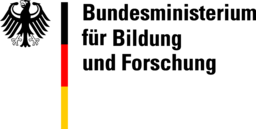
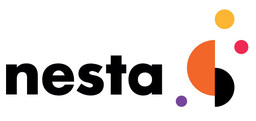
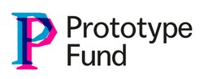

# Funding and Support

## Bundesministerium für Bildung und Forschung {#bmbf}

VFRAME development in 2018 and 2019 was supported with a grant from the German Federal Ministry of Education and Research (Bundesministerium für Bildung und Forschung) and the [Prototype Fund](/partners/prototype-fund/).  This grant supported development of the VCAT annotation platform, the VFRAME search engine, our scene summarization library, and our first synthetic datasets.

---

## SIDA / Meedan {#meedan}

Meedan builds digital tools for global journalism and translation.  The Check project has worked to build online tools, support independent journalists, and develop media literacy training resources that aim to improve the investigative quality of citizen journalism and help limit the rapid spread of rumors and misinformation online.

VFRAME is proud to have been supported with a three-year grant (2019-2021) by Check Global.  With this grant, we have developed tools to integrate computer vision in to Check's infrastructure, allowing computer vision to be deployed in the effort to verify breaking news.

* [Meedan](https://meedan.com/)
* [Check](https://meedan.com/en/check/)
* [VFRAME Check API](https://github.com/meedan/vframe)

---

## NESTA {#nets}

Through a grant, NESTA supported VFRAME's research into synthetic datasets in 2019-2020 as well as continued development of the VFRAME search engine.  Through this grant, we were able to make better 3D models and enhance our synthetic data generation process, producing more realistic imagery which in turn trains more accurate models.

* [NESTA](https://www.nesta.org.uk/)

---

# NLnet and NGI0 {#nlnet}

VFRAME received support from the [NLNet Foundation](https://nlnet.nl/) and Next Generation Internet (NGI0) supported research and development of face blurring and biometric redaction tools during 2019 - 2020. Funding was provided through the [NGI0 Privacy Enhancing Technologies Fund](https://www.ngi.eu/about/ngi-zero/), a fund established by NLnet with financial support from the European Commission’s Next Generation Internet program.

---

## Prototype Fund {#ptf}

The Prototype Fund is a public program run by Open Knowledge Foundation Germany that focuses on emerging challenges and radically new solutions. Individuals and small teams can apply for funding to test their ideas and develop open source tools and applications in the fields of civic tech, data literacy, data security and more.

VFRAME development in 2018 and 2019 was suppored with a grant from the Prototype Fund and [German Federal Ministry of Education and Research](/partners/bmbf/).  This grant supported development of the VCAT annotation platform, the VFRAME search engine, our scene summarization library, and our first synthetic datasets.

* [Prototype Fund](https://prototypefund.de/en/)
* [Project Page](https://prototypefund.de/project/vcat-visual-collections-and-training-data/)