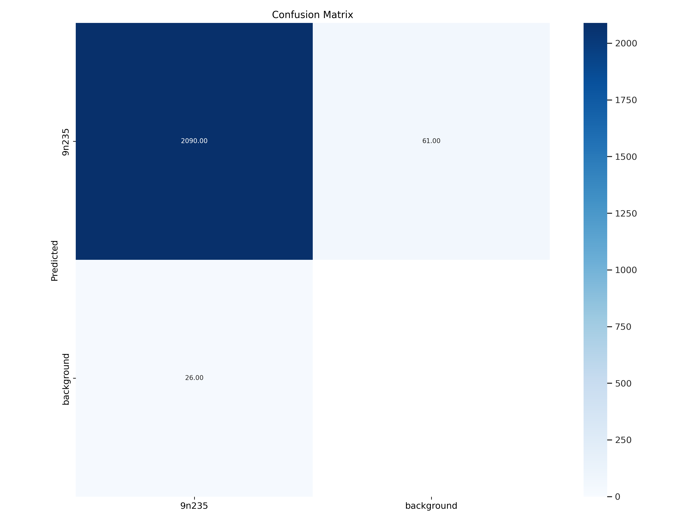
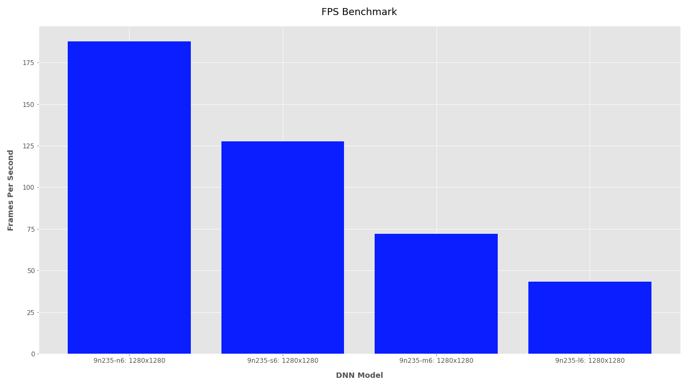




This page outlines the development process of building an object detector for the 9N235/9N210 submunition using photography, photogrammetry, 3D modeling, 3D printing, and deep convolutional neural networks. For code and models visit [github.com/vframeio/vframe](https://github.com/vframeio/vframe). The model is free to use for commercial purposes if the LICENSE and CREDIT information is included (MIT). To run the model on your dataset, download the VFRAME CLI image processing [software](https://github.com/vframeio/vframe) and run:

```
# Detect 9N235/9N210 and draw detections with confidence score
vf pipe open -i input/ detect -m 9n235 draw display
```

#### Updates:
- February 2023: Improved detection models (version 1C) released
- October 2022:  VFRAME partner Tech 4 Tracing dispatches [policy brief (PDF)](https://tech4tracing.org/s/T4T-PolicyBrief1-Aug2022.pdf) on using new technology for illicit arms control following our joint presentation at United Nations in summer 2022
- June 2022: VFRAME presents prototype 9N235 and AO-2.5RT detectors at United Nations Eighth Biennial Meeting of States on Small Arms and Light Weapons in NYC with Tech 4 Tracing



## Introduction

In spring of 2022 the VFRAME team partnered with [Tech 4 Tracing](https://tech4tracing.org) to visit an explosive ordnance training center in Europe with the goal of capturing photogrammetry scans of free-from-explosive (FFE) submunitions, including the 9N210 submunition (rendered above). Several hundred high-resolution photos were used to reconstruct a millimeter-accurate 3D model of the submunition's geometry. With the high-fidelity 3D model as a reference, thousands of procedurally randomized photorealistic synthetic training images were generated, annotated, then used to train a convolutional neural network object detection algorithm.

**The current 9N235/9N210 object detector model yields a 0.98 F1 score** on a custom benchmark dataset with challenging examples including partially occluded, partially exploded, damaged, dirt-covered munitions in various weather conditions from various camera angles and lenses. The new model (version 1C) was released on February 1, 2023, is available for download with a MIT license at [github.com/vframeio/vframe](https://github.com/vframeio/vframe), and improves the overall performance of the previous model (version 1B) released in July last year. 

<div class="video-player" >
    <video width="100%" height="auto" controls poster="images/9n235_model_07_2740_poster.jpg">
        <source src="https://files.vframe.io/vframe_io/9n235_model_07_2740.mp4" type="video/mp4">
        Your browser does not support the video tag.
    </video>
    <div class="caption">
        Test video showing detections for 9N235 using the version 1C object detector
    </div>
</div>

{}

The current version (1C) performs best on human-height videos or images created with smartphone cameras and is designed to handle typical artifacts common in online imagery including watermarks, compression, light motion blur, and various image ratios. An additional version designed for aerial detection is planned for release later this year. 


### About VFRAME

VFRAME is a computer vision project that develops open-source technology for human rights research, investigative journalists, and conflict zone monitoring. After several years of research and development into synthetic data fabrication techniques using [3D-rendering](/3d-rendered-data) and [3D-printed](/3d-printed-data) data, this is the first publication of an object detection algorithm that uses all combined methods, with enough benchmark data to confirm the results. 

Many thanks to the [organizations](/funding) that have supported VFRAME during the last several years and to VFRAME's latest partner Tech 4 Tracing for facilitating access to the FFE munitions, and to Fenix Insight for additional development support and coordination on benchmark data development, to SIDA/Meedan for continued operational support, and to PrototypeFund.de for initial research support into computer vision for human rights and synthetic data.


## 9N210/9N235 Submunition


The 9N210 and 9N235 are nearly visually identical high-explosive fragmentation submunitions (i.e. the explosive elements of cargo rocket-delivered cluster munitions). Upon detonation the explosive payload blasts metal fragments in all directions, indiscriminately killing or maiming bystanders including non-combatant civilians. The munition has been widely documented in the Ukraine conflict ([reported incidents]( "Reported Incidents")).[^9n235_documentation] While neither Russia nor Ukraine are party to the Convention on Cluster Munitions[^ccm], they are both bound by the Additional Protocol II of Geneva Conventions, which prohibits indiscriminate attacks.[^geneva_convention]

Based on these considerations, the distinctive visual appearance of the 9N235/9N210, and the fact that the object has a well-documented design flaw that leads to frequent failed detonation resulting in widespread unexploded ordnance (UXO) contamination,[^9n235_failure_rates] VFRAME selected the 9N235/9N210 as a candidate for object detection development. To test the hypothesis, we set about to build an object detector and evaluate its performance.


## Building a Detector

The initial challenge for building a computer vision-based object detector for this munition was insufficient quantity and quality of reference photographs of the object. While the number of online photographs of the 9N235/9N210 has increased since 2022, the total amount of images and videos still only reaches into the hundreds. After splitting these for training, validation, and test datasets; it becomes clear that it would not be possible to build a robust and performant 9N235/9N210 object detector using only images from online sources.

An innovative approach developed by VFRAME to overcome this challenge is to use an art-driven, data-centric development process that builds from the ground-truth up using an interdisciplinary combination of photography, photogrammetry, 3D-rendering, 3D-printing, custom software, and artistic replication. Using this approach, a high-performance 9N235/9N210 detector was developed without any data from online sources, except for use in the final benchmarking dataset to evaluate the algorithm’s performance.

The first step will bypass the internet as a source of data and instead find access to the real submunition as the ground-truth source of data as a 3D model using photogrammetry.

## Step 1: Photogrammetry

Photogrammetry is the process of using multiple high-resolution photos to reconstruct an object’s 3D geometry and surface texture via the structure from motion (SfM) technique. Creating 3D scan models of physical objects has become increasingly simplified over the last decade, but there are many trade offs between different software, camera, and capture approaches. There are also dedicated handheld 3D scanners and smartphone devices that simplify the process further by integrating high-end depth sensors with on-device photogrammetry processing. There is no single best approach. For this project, the goals were high-accuracy, portability, and the ability to use utilize existing hardware, in this case a DSLR camera and GPU workstation.

The most important step though is neither the capture technology nor the software but finding safe access to a free-from-explosive munition. The munition should also be undamaged otherwise the damaged areas will become part of the ground-truth geometry. It should also be representative of the full object as it appears in conflict zones, and not be significantly altered during the free-from-explosive conversion.

To access the 9N235/9N210 submunition, VFRAME partnered with the NGO Tech 4 Tracing; an international, non-profit partnership working to apply new technologies to arms and ammunition control. In the early spring of 2022, both teams traveled to an armed forces explosive ordnance disposal (EOD) center in Europe and carried out the photogrammetry capture.


In total about 200 high-resolution photos were used to create the 3D model. An automated turntable was used to expedite the process. Each camera position in the graphic below shows the camera position for each photo.


After post-processing the images and completing the 3D reconstruction process, the final result is a millimeter-accurate 3D model. This becomes an ideal ground truth for generating synthetic training data.


## Step 2: 3D-Rendered Synthetic Data

Typically, training images are gathered from online sources or existing surveillance systems and then manually annotated in-studio or outsourced to image annotation services in foreign countries. This creates multiple issues, among them data security, data bias, labor exploitation, cost, and the possibility of errors.

The use of 3D-rendered synthetic data overcomes these problems because the annotations are automatically generated by software, diversity and bias can be controlled for, weather conditions can be programmed, and it can lower the overall cost. For these reasons it is a transformative technology, especially for rare and dangerous objects such as cluster munitions.

To develop the 9N235/9N210 synthetic training dataset, over 10,000 unique images were rendered using various lighting environments, scene compositions, dirt variations, damage variations, and camera lenses. Each factor is randomized within a range of carefully selected values.

The way objects appears in  3D-rendered synthetic image is based on observations from the preliminary research. It reflects how the submunition lands, surface material properties and weathering effects, and the terrain where its being documented. 

Sometimes the tail fins will break, leaving a silver metal tube with various permutations of one to six integral or partial fins visible, or none. These variables can all be modeled for. But at some point, either through extensive damage or majority occlusions, the object is no longer integral and should not be detected at normal threshold settings. For example when only a minority of the metal is visible and all fins were lost the 9N235/9N210 simply becomes a metal tube. For large-scale OSINT video analyses non-integral objects can be ignored or included by tuning the detection confidence thresholds. 

The example images below were rendered using a simulated 40mm lens on a DSLR type sensor with F5.6 aperture using afternoon lighting and center-focused on the 9N235 with all 6 fins intact. To improve diversity, every image is procedurally randomized then manually reviewed to ensure the training data aligns with the expected outcomes. This is just 1 of over 10,000 randomized training images created for the training dataset.


## Step 4: 3D-Printed Synthetic Data

With the right lighting, textures, and render settings, 3D-rendered images can achieve convincing photorealism but they still contain artifacts of a simulated world and risk overfitting if the target objects are too rigid or lack diversity. Based on our research and training tests from the last several years, algorithms trained on synthetic data will always produce overconfident and misleading results when tested on more 3D-rendered, even when all parameters are randomized. This is logical because the test dataset is comprised of the same foundational synthetic features and textures used in the training images. It is not an inherent problem of 3D-rendered synthetic data though, rather of basic overfitting. To overcome this problem, VFRAME has pioneered a hybrid approach that uses [3D-printed data](/docs/research/3d-printed-data) to generate additional "synthetic" images in the real world.


"3D-printed synthetic data" (or just 3D-printed data) refers to the process of creating a 1:1 physical replica of an object using 3D-scanning, 3D-printing, and artistic replication. By recreating the digital surrogate object in the real world it escapes the limitations of 3D-rendered worlds and bridges the gap towards a more real reality. In other words, the 3D-printed replica can now be placed in a controlled staging environment to create scenes that would otherwise be too difficult to 3D model.

Another significant advantage of using 3D-printed data for submunitions is safety. Obtaining submunitions always involves risk, and removing the explosives material to make it FFE involves further risk for explosives ordnance (EOD) personnel. The 3D-printed replicas are inert, hollow, plastic, and can even be made using environmentally responsible bioplastics like PLA.

The results can be convincingly real. Below are two photos of 9N235/9N210 submunitions. One is real and one is a replica. Both are partially covered with mud and photographed with the same camera in wet forest terrain. 



## Benchmark Data

With the submunition 3D-modeled, synthetic images 3D-rendered, and 3D-printed models photographed, the next step is to curate the benchmark dataset to evaluate the neural network's performance.

Benchmark data is essential for understanding the accuracy of the trained object detector. An easy benchmark dataset yields unrealistic expectations for what the detector is capable of. To overcome bias in  benchmark data, it's helpful to spread this task across many seasons, terrain, contributors, and hardware. Images should contain easy, medium, and difficult scenarios. Not only is diversity useful for the model metrics, but it helps communicate to end users how well the detector can be expected to perform when, for example, a munition is partially exploded or broken. Or when it will trigger false-positives on similar looking objects. This is especially important for objects that pose a risk to life.


The results also help guide the thresholds settings for greedy or conservative deployments, where false positives rates are balanced with higher true positive recall rates. Because the output is always a probabilistic determination the actual deployment thresholds must be customized to the target environment. For example, a million-scale OSINT video analysis could first triage everything above 80% accuracy, then look deeper at lower confidence (50-80%) matches when time permits. The more permissive threshold will usually locate more objects but at the expense of more false positives. In another example, an aerial survey of an attack site could start with a low-confidence threshold because the environment is more constrained and any object slightly resembling the target munition could be analyzed further by zooming in.


## Model Metrics

The model is trained using synthetic data but evaluated using multiple types of real data, including images sourced online. The most common metrics are applied to measure how well it can detect the true-positives (recall), how well it ignores the false-positives (accuracy), and how precise the bounding boxes are (mAP). These metrics are combined into one score called the F1 to give an summarized performance metric.

For this model the F1 score is 0.98 at 0.641 confidence. This means that if you set the confidence threshold (e.g. `vf pipe detect -m 9n235 --threshold 0.641`) in the processing software you should expect high-accuracy results, with only a few images missed. If you want to detect everything (recall=1.0) the confidence could be dropped to 0.0 (e.g. `vf pipe detect -m 9n235 --threshold 0`), but this would trigger more false positives and bring the accuracy down to 0.2 which might be acceptable in certain scenarios.





Another way to visualize performance is to look at the confusion matrix, which shows the true positive detections (2076) compared to the false positive (23) and false negative (63). The numbers here are highly dependent on the quality of the benchmark test images.





## Step 6: Test Images

Finally, it's important to not only look at the metrics but also to look at the actual detections in the test set. Below are several test images that show the target object partially occluded by tall grass. Because this type of occlusion was designed for in the training dataset (based on prior research into how the object appears in Ukraine) the detector is easily able to detect it with high confidence Also, the test images below are vertical, but most of the synthetic training images were horizontal. It's important to include all aspect ratios in the test dataset. For further insights on the media ratio distribution see the post on [media attribute analysis](/media-attribute-analysis).



When there's motion blur, the detector should still work well. Here an older camera was used with a poor quality sensor that also produces overexposed areas on the metal. The detector performs well and is also able to ignore the false-positive decoys placed in the scene.


Another test determines if the detector is smart enough to differentiate between a complex scene of metal tubes and submunitions mixed together. Most of the targets are detected with over 90% accuracy, but the object in the top middle drops to 75% because the black fins are less prominent here and wet leaves are covering an important detail where the cylinder meets the fin assembly.


Referring back to the 3 images used as reference to evaluate the detectability, these are now used as benchmark data to evaluate the detector’s performance. None of these images were included in the training dataset. The results speak to the power of an artist-driven, data-centric approach to developing neural networks. All 3 objects were easily detected, even the submunition partially visible and still inside the rocket.

{{< three-col-images
    src1="images/osint_detections/tw_9n235_FMr6VlmXIAI6iGN.jpg"
    src2="images/osint_detections/tw_9n235_FM-_wlqaQAA0-1I.jpg"
    src3="images/osint_detections/tw_9n235_FN0a5zIWQAMkN4S.jpg"
    caption1="Detection result on social media reference imagery. Source: https://twitter.com/olehbatkovych/status/1498285374153633797"
    caption2="Detection result on social media reference imagery. Source: https://twitter.com/Ukrain_War/status/1499628097208868869"
    caption3="Detection result on social media reference imagery. Source: https://twitter.com/eod205/status/1503387454258266118"
>}}

## Performance

The model is trained in multiple architectures for deployment on workstations or mobile/edge devices. Running on a HEDT (high-end desktop workstation) achieves a maximum 187 FPS with the nano architecture and the full performance (recommended) model reaches 43 FPS. 



{}


## Conclusion

The multi-step process described here has shown success in detecting an explosive ordnance object with distinctive features in photographic and video images exhibiting a wide range of lighting and weather conditions and object orientations. Its high performance makes it suited for detecting the 9N235/9N210 in OSINT applications given typical source image artifacts including watermarks, compression, and light motion blur, and various image ratios. 

This project is an example of new technology-based innovations that will continue to improve mine action and human rights investigators’ ability to detect a range of conventional arms and ammunition in a variety of contexts, thereby bolstering existing efforts in conflict zone monitoring and accountability.


### Future Reports

- OSINT analysis for 100K image dataset (April 2023)
- OSINT analysis for 1M video dataset (May 2023)

### Credits

- Adam Harvey: AI/ML systems, synthetic data, object detection, 3D printing
- Josh Evans: photogrammetry, 3D reconstruction, 3d modeling, 3D printing
- [Tech 4 Tracing](https://tech4tracing.org): EOD coordination
- [Fenix Insight](https://fenix-insight.com): additional replica/surrogate fabrication and benchmark dataset collaboration

### License

- The model files are released open-source with an MIT license. They are free to use for commercial systems **only** if the license is included and distributed with any software deployments.
- Unless otherwise noted, all images are &copy; Adam Harvey / VFRAME.io

### Funding

- Development of the 9N235/9N210 detector is largely based on several years of prior research supported by grants from Prototype Fund and SIDA/Meedan (2019-2021)
- Initial development self-supported by workshops and exhibition fees (2022-2023)
- Performance improvements and benchmark dataset improvements for version 1C supported by [Fenix Insight](https://fenix-insight.com/) (2022-2023)
- Read more about VFRAME's supporters [here](/funding)




---

## Appendix

### Reported Incidents

List of incidents involving documented use of the 9N235/9N210 submunition

{}


[^9n235_documentation]: See https://armamentresearch.com/russian-9n235-submunitions-documented-in-ukraine-2022. The investigative group Bellingcat has determined that the 9N235/9N210 is “the most common type of cluster munition” used in the Ukraine conflict. See https://twitter.com/bellingcat/status/1502237551146459137. 
[^ccm]: As of late March 2023, the Convention on Cluster Munitions had 111 States Parties and 12 Signatories. See https://www.clusterconvention.org/states-parties. 
[^geneva_convention]: See Protocol Additional to the Geneva Conventions of 12 August 1949, and relating to the Protection of Victims of Non-International Armed Conflicts (Protocol II), 8 June 1977. See https://ihl-databases.icrc.org/en/ihl-treaties/apii-1977 (Protocol II text) and https://ihl-databases.icrc.org/en/ihl-treaties/apii-1977/state-parties (States Parties and Signatories).
[^9n235_failure_rates]: For a discussion of the failure rate and resulting UXO caused by this submunition, see https://www.gichd.org/en/resources/publications/detail/publication/explosive-ordnance-guide-for-ukraine-secon
[^hrw_ukraine_cluster]: https://www.hrw.org/news/2022/05/11/end-cluster-munition-attacks-ukraine
[^hrw_syria_cluster]: https://www.hrw.org/news/2016/07/28/russia/syria-widespread-new-cluster-munition-use
[^hrw_kherson]: https://www.hrw.org/news/2022/12/13/ukraine-apparent-cluster-munitions-hit-kherson
[^gichd_ukraine_ed2]: Explosive Ordnance Guide for Ukraine https://www.gichd.org/en/resources/publications/detail/publication/explosive-ordnance-guide-for-ukraine-second-edition/