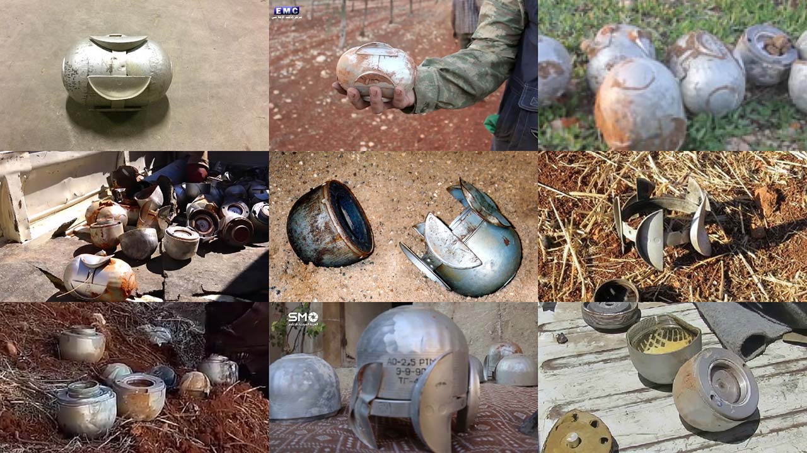

# 3D Rendered Training Data

- <strong>Active research area</strong>. New methods will be published soon using photogrammetry base models.

Developing synthetic image datasets for training object algorithms has been an active research area at VFRAME since fall 2018. In early 2019, VFRAME received a grant from PrototypeFund.de to develop the idea further and in fall 2019 a public [prototype](https://github.com/vframeio/vframe_synthetic) was released. In January 2020 VFRAME will release the first publicly available vision models for detection illegal cluster munitions in conflict zones.

Object detection is the ability for computer vision to detect and localize an object of interest in an image or video. Creating custom objection detection models requires training data (around 2,000 diverse images per class) and since existing publicly available image datasets do not include images or annotations that are relevant to conflict zones, custom training datasets must be created to locate objects such as cluster munitions.

However, videos containing cluster munitions are typically limited in quantity; and many videos are captured in extreme situations with low resolution, motion blur, or in partially occluded views, further reducing the quality and quantity of potential training data. In these situations synthetic data becomes the only option.

Synthetic training data is 3D-modeled photorealistic imagery based on a set of real, verified images. Often only a few real (ground truth) images are needed to recreate the object as a 3D model. The 3D model can then be textured and placed into a 3D environment to match the real images. This 3D environment can then be customized to generate lighting, weather, camera, and scene variations. Simulated camera motion is then used to generate a series of still frames that can be used as training data to augment the initial real image dataset. 

#### VFRAME Synthetic Data Workflow

- Gather example images from target domain (ie cluster munitions in Syria)
- Determine object measurements and build 3D models
- Create 3D textures to match target domain imagery
- Reconstruct 3D scenes to match target domain imagery and camera movements
- Script camera and lights to create diverse set of training images in Blender
- Export color-coded class-label mask images
- Convert images to CSV with bounding box locations
- Train object detectors using YOLO

The most time-consuming stages are gathering example images and building 3D models of the munitions. Once the 3D models are built, a set of diverse environments and camera paths are manually built to produce a diverse collection of angles, lighting, backgrounds, and partial occlusions. Because the images exported from 3D applications are often too clean, they are then post-processed to match target domain imagery. 

In the prototype shown here, the AO-2.5RT/M cluster munition is used as an example. The AO-2.5 cluster munition is banned by the [Convention on Cluster Munitions](https://en.wikipedia.org/wiki/Convention_on_Cluster_Munitions) yet is still used in the Syrian conflict. 

By using a small collection of existing images and videos of the AO-2.5RT to understand the geometry, texture, and assembly the object has been remapped into a 3D model. Photorealistic texture mapping was used to create a surface appearance that resembled the ground truth images. The textured 3D models are then added to customized 3D environments to match the location and lighting in Syria where the munitions are appearing. This helps full-image based deep neural network object detection algorithms (eg Darknet's Yolo) learn the inference not only for the object, but also the relationship between object and scene.

To generate annotations for training, each object is rendered as a  color-coded pixel mask and associated with a class label. Multiple viewpoints for each object are generated by animating camera pathways through the scene, and placing objects in different, sometimes overlapping or partially occluded, positions.

Although 3D modeling the objects and scenes in this way is still labor intensive, it has the potential to be scalable and provide training data for objects that would otherwise not exist in the quantity and quality needed to train an object detection model.

Building synthetic datasets has the potential to vastly increase the number of training samples used to create custom object detection models, but it needs to be modeled according to the reality where it will be deployed. Building a small (real) dataset first can help guide this process. As there are still many discoveries to be made with this process, check back soon for updates as the project progresses.

#### Exhibitions

- 2019: Design Museum Design of the Year ([nomination](https://designmuseum.org/exhibitions/beazley-designs-of-the-year/digital))
- 2019: Ars Electronica ([Award of Distinction](https://calls.ars.electronica.art/prix2019/prixwinner/34003/))
- 2018: Ars Electronica EXPORT

#### Acknowledgments

Research in collaboration with <a href="https://syrianarchive.org">Syrian Archive</a>

#### Funding

Parts of this research have received funding from [PrototypeFund.de](/funding/#ptf), Ars Electronica Export (AT), lecture and workshop fees, and with 3D printing support from Karlsruhe HfG (DE) for SLA prototypes. 