

Understanding large video datasets with simple media attributes can help reduce processing times by removing low-probability outlier videos

Simple scripts for preliminary analysis of large video datasets can help make projects run smoother by understanding hardware requirements, estimating processing time, and visualizing video frame size distribution. This research post explains how to use the VFRAME media attributes scripts and why it should be the first step when processing large video datasets. The following post outlines the process for analyzing a dataset of 168,139 videos related to TheBrownMoses YouTube channel. Estimated machine time is 1-2 hours and human time is less than 5 minutes.

**To generate plots for your dataset, run the following commands:**
```
# Step 1: Create filelist .txt 
find ./input/ -type f -name "*.mp4" > analysis/filelist.txt

# Step 2: Generate media attributes CSV
vf utils media-attrs -i analysis/filelist.txt -o analysis/attributes.csv

# Step 3: Sanitize and filter media attributes 
vf utils media-attrs-filter -i analysis/attributes.csv -o analysis/attributes-filtered.csv

# Step 3 optional: print summary statistics
vf utils media-attrs-summarize -i analysis/attributes_filtered.csv

# Step 4: Generate plots from CSV data
vf utils media-attrs-plot -i analysis/attributes-filtered.csv -o analysis/plots/

# add --help to any command for more options
```

Download the software at https://github.com/vframeio/vframe


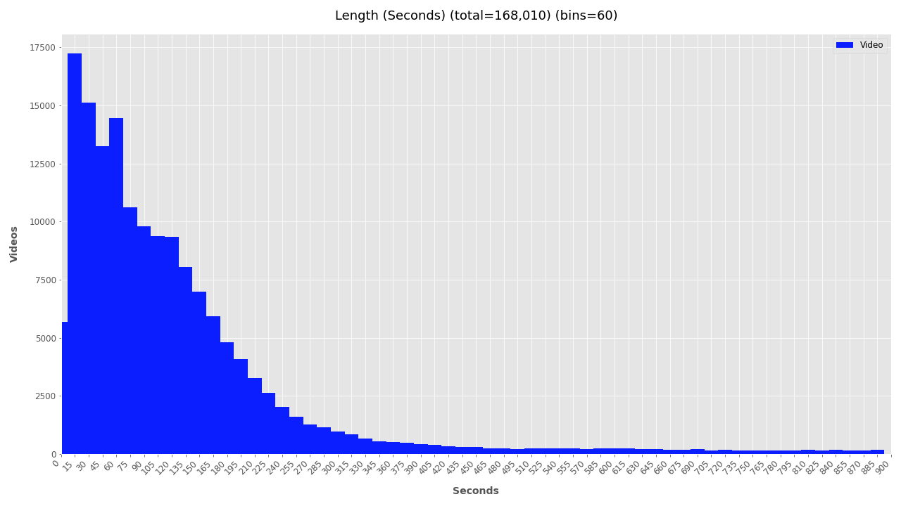

Before analyzing hundreds of thousands or millions of videos it's helpful to visualize the distribution of video attributes, such as frame size, duration, date, and frame rate. A simple approach to visualizing this information is to use the [PyMediaInfo](https://github.com/sbraz/pymediainfo) library, a Python wrapper around the original [MediaInfo](https://mediaarea.net/en/MediaInfo) library. To avoid confusion, the term *media attributes* is used here to describe immutable attributes of a video or image file, and does not refer to other content-based metadata attributes such as those inferred by neural networks.

Media attribute analysis is rather simple and often overlooked, but can reveal useful insights about the structure of video datasets. Because it runs fast and is multithreaded, it's an easy first step to start planning a large-scale analysis. Faster processing speeds are achieved with high-speed SSD storage (100-500 files/sec), while using HDD-based networked-attached storage (NAS) devices will be slower (20-50 files/sec). If possible, first migrate your dataset to the fastest storage medium. This also speeds up subsequent video analysis algorithms.

The videos used in this demo were all obtained using [youtube-dl](https://youtube-dl.org/) Python package, a custom spidering script, and the YouTube channel [TheBrownMoses](https://www.youtube.com/user/TheBrownmoses) (aka Eliot Higgins/Bellingcat). 

To understand how the media attributes code works, here's a basic example showing how to access each attribute:


```python
# A basic example using PyMediaInfo to extract video attributes
from pymediainfo import MediaInfo

fp_in = 'path/to/your/videos/myvideo.mp4'

# Get media attributes
attrs = MediaInfo.parse(fp_in).to_data()
video_attrs = [x for x in attrs['tracks'] if x['track_type'] == 'Video']  

# Access single attributes
width = video_attrs.get('width', 0)
height = video_attrs.get('height', 0)
duration = int(video_attrs.get('duration', 0))
frame_rate = float(video_attrs.get('frame_rate', 0))

print(f'width: {width}, height: {height}, duration: {duration}, fps: {frame_rate}')
```


## Media Attributes Analysis

To run this analysis, VFRAME includes the command `vf utils media-attrs`. It's input is a line-delimeted text file, with one filepath per line, or a directory path. The output is a CSV file. Multi-threading is used to increase processing speed.

### Step 1: Create List of Files

For large datasets it's recommended to use bash `find`. For smaller datasets the command also accepts a directory path and list of extension to glob for.

```
# Large datasets: Generate file list .txt
find ./input/ -type f -name "*.mp4" > analysis/filelist.txt

# Small datasets: use directory path as input for step 2
vf utils media-attrs -r -i input/ -e mp4 -e mov ...
```

### Step 2: Extract Attributes

```
# Large datasets
vf utils media-attrs -i input/filelist.txt -o analysis/attributes.csv

# Small datasets, with recursive globbing for multiple extensions
vf utils media-attrs -r -i input/ -e mp4 -e mov -o analysis/attributes.csv
```

The output is formatted as:

```code
# CSV output from the VFRAME mediainfo extractor
W7AY5_EblJo.mp4, mp4, True, 1280, 720, 1.778, 4932, avc1, 197280.0, 25.0
AoR8fOHrCH4.mp4, mp4, True, 1280, 720, 1.778, 562, avc1, 22480.0, 25.0
Psy4_7Rlz6Q.mp4, mp4, True, 1280, 720, 1.778, 5699, avc1, 227960.0, 25.0
...
```

### Step 3: Filter Data

Often there will be corrupted or partial video files that need to filtered out, especially when downloading videos using youtube-dl. To sanitize the data and remove these rows from the CSV run the `media-attrs-filter`command with no additional parameters. This removes videos with null attributes.

```code
# Example of corrupted video with 0 frame count
corrupted.mp4, mp4, True, 1280, 720, 1.778, 0, avc1, 197280.0, 0  <-- corrupt video
```

Remove the corrupted entries using the following command:
```
# Step 4: Sanitize data
vf utils media-attrs-filter -i analysis/attributes.csv -o analysis/attributes_filtered.csv
```

Additional parameters can be used to filter outlier data, such as videos that are too short, long, small, big, old, or new. This is a subjective step. Depending on your project it might make sense to filter out videos that are too small to contain the target object, to remove videos that are over 15 minutes and likely to be livestreams, or to remove videos that are too old to be relevant for an investigation.

```
# Step 4: Filter out videos longer than 15 minutes, smaller than 640x360px,
#   and shorter than 2 seconds
vf utils media-attrs-filter -i analysis/attributes.csv -o analysis/attributes_filtered.csv \
  --max-seconds 900 --min-width 640  --max-seconds 900 --min-width 640 --min-seconds 2 \
  --min-height 360

# use --help to see more options
vf utils media-attrs-filter --help
```

### Step 3 (optional): Summarize

To quickly summarize the contents of the dataset run the `media-attrs-summarize` command. The summary statistics show the basic quantities for time and media elements, and comparisons for human vs machine perceptual labor. These stats are useful for quantifying and comparing datasets. The dataset of BrownMoses videos contains is about 457 hours long. Tasking a researcher to watch every video during 8 hour work days would take 1,373 days (though in reality less because the video could be skimmed) and for a machine running at 240FPS it would require 48 days to analyze every frame. In practice the machine analysis time can be reduced using techniques like perceptual hashing to skip similar frames.

```
# Optional: print summary statistics
vf utils media-attrs-summarize -i analysis/attributes_filtered.csv
```

```code
n_days: 457.667
n_hours: 10,984.003
n_minutes: 659,040.193
n_seconds: 39,542,411.556
n_frames: 1,001,047,322
n_videos: 168,010
n_videos_lt_1min: 51,453
n_videos_lt_2min: 95,547
n_videos_lt_3min: 125,827
n_videos_lt_4min: 140,583
n_videos_lt_5min: 146,615
n_days_human_8hrs: 1,373.000
n_days_human_24hrs: 457.667
n_days_machine_30fps: 386.207
n_days_machine_60fps: 193.103
n_days_machine_120fps: 96.552
n_days_machine_240fps: 48.276
```


### Step 4: Visualize Data

The output is still the same CSV format and can now be plotted using the `media-attrs-plot` command with the filtered CSV as input and a directory path as output.

```
# Step 5: Plot Data
vf utils media-attrs-plot -i analysis/attributes_filtered.csv -o analysis/plots/
```

The plotting script outputs histograms for each attribute showing the total number of videos for each histogram bin. For example, the width and height plots below show that over 100K videos are around 1280 x 720px wide and around 20K are about 640 x 360px. 

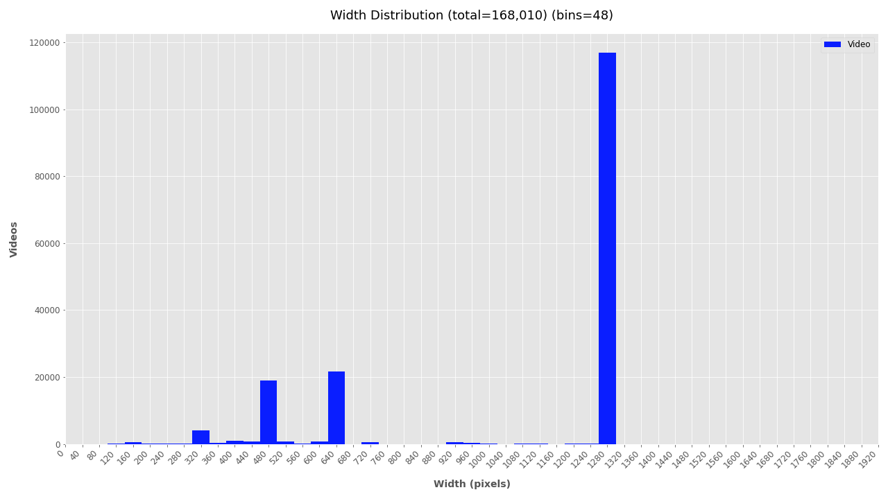

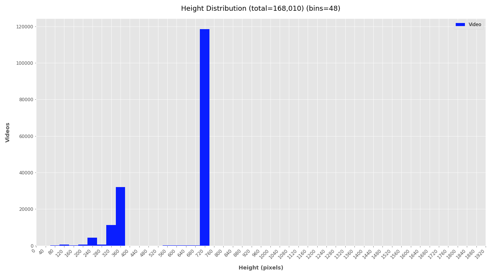

### Adjust K-Means Clusters for Aspect Ratio Distribution

Fore more clarity on the aspect ratio distribution, [K-Means clustering]() is used to cluster the width and height data. The number of clusters to use for the calculation will depend on your dataset and experimentation. Refer to the height and width plots to estimate the number of clusters in your video dataset. In this dataset, there appears to be dense clusters at 1280x720 and 640x360 with scattered width distribution at 720px height. Subjectively, K-Means should use 6 or 7 clusters. It's also possible that your dataset has only one video size and the cluster size is 1 (then use `--clusters 1`).

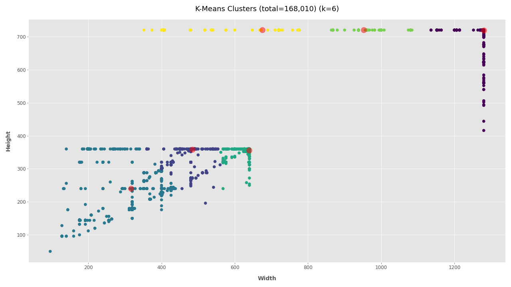

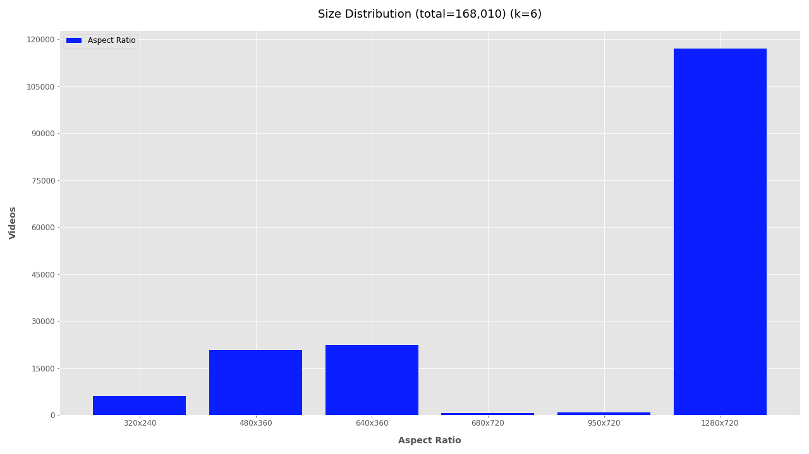

Clearly, most of the 168K videos are 1280&times;720 pixels, a common format for videos shared online. 


### Frames Per Second

Plotting the FPS provides some level of understanding for the type cameras being used, but comes with a caveat. Videos posted online are often compressed or converted into different formats. While it appears that most videos are 25FPS, keep in mind this may be the result of conversion scripts and not the actual frame rate of cameras. For raw videos, the FPS could be used to group videos by capture devices. Here it is not yet useful, but could be utilized in the previous step to filter out videos from high-frame-rate devices and process these differently.

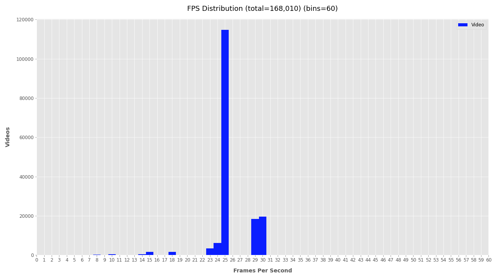

### Duration

Visualizing the duration of videos helps understand how conflicts are being documented and how much time is needed for processing. The plot below clearly shows a strong trend: video duration is inversely related to its quantity with a long-tail distribution. From this simple plot, a helpful insight can be extrapolated suggesting that a "typical" YouTube video related to, documenting, or commenting on a conflict zone is most likely going to be 1-3 minutes. 

Duration stats also help estimate hardware resources needed for deeper analysis. The total duration of this filtered video dataset is 1,468 hours of footage. If one person were to watch it would take 3.7 years of 8-hour days, or 1.25 years of non-stop watching. Analyzing the footage at 30FPS would require just over 1 year, a half year at 60FPS, and just 1.5 months at 120FPS. In total this would analyze 1 billion frames.

The needed hardware specifications are then allocated based on this output and the project deadlines. For an object detection analysis, a GPU workstation capable of processing at a combined throughput of 1,000FPS could be used to analyze the filtered dataset in less than a week, while a high-end multi-GPU workstation with high-throughput storage media could process it in just one day.

To customize the intervals for datasets with longer or shorter videos, use the options for `--seconds-bins` and `--seconds-bin-size`. An additional plot with auto-generated bin is created (`_auto_interval.png`), but it's usually better to manually tweak this two values to fit your data.


### Date

Finally, the file creation timestamp is used to plot the frequency of videos for each year, month, and day. The daily and monthly plots can become unwieldy for larger datasets and are omitted by default. To include monthly or daily plots add `--monthly` or `--daily` respectively. To exclude date plots simply add `--no-yearly`, `--no-monthly`, or `--no-daily`.

```
# Generate only yearly plots:
vf utils media-attrs-plot -i analysis/attributes_filtered.csv -o analysis/plots/ 

# Generate yearly, monthly, daily summaries
vf utils media-attrs-plot -i analysis/attributes_filtered.csv -o analysis/plots/ --daily --monthly
````

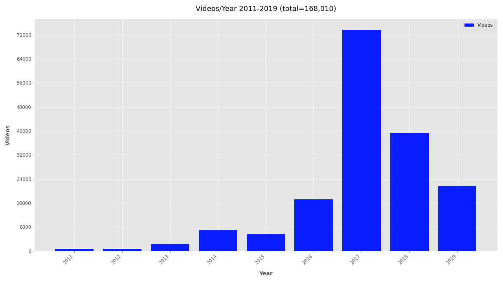

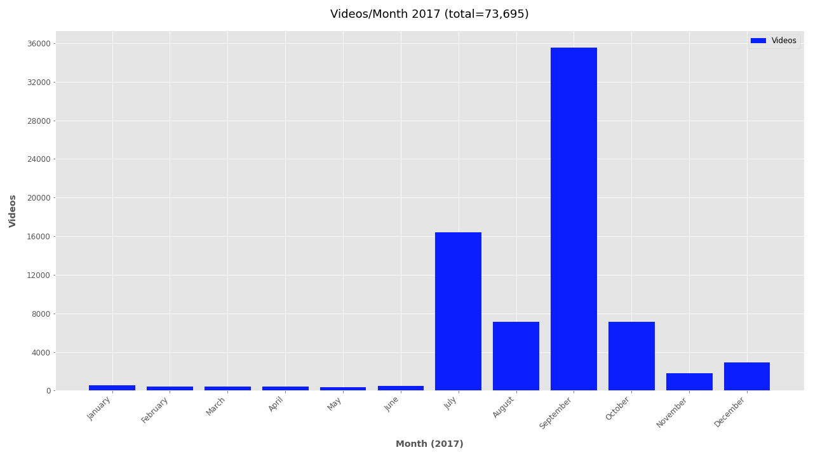

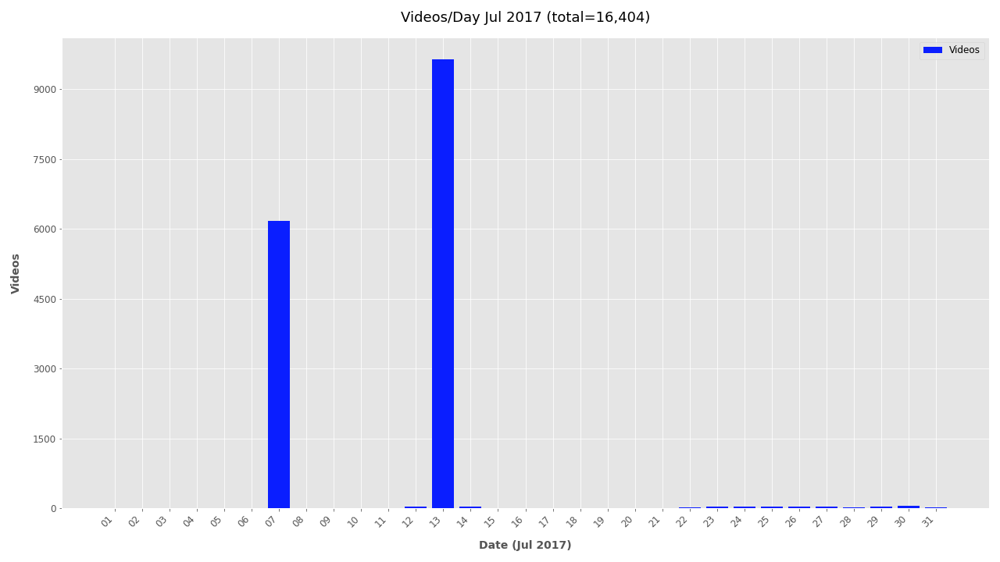


### Summary

Analyzing media attributes for 168K videos required only 1.5 hours of processing time, 5 minutes of administrative time, and no special hardware; yet provided helpful preliminary insights about the resources needed for further analysis. By filtering out videos that are too large, small, short, old, or new processing times can be reduced or jobs can be better scheduled based on priority data.

From this quick analysis a noisy dataset of 168K videos linked to TheBrownMoses YouTube channel became more understandable and easier to communicate. A few quick insights learned:
- Videos were uploaded mostly between 2016-2019, with almost twice as many in 2017 as in any other year
- Most videos (117,080) are medium resolution (1280x720 pixels), about 42,000 were low resolution (480x360 or 640x360 pixels), and about 6,000 videos are very low resolution (320x240 pixels)
- The most common video lengths are between 15 seconds and 3 minutes


NB: The dataset used in this demo contains a lot of noise and does not accurately represent all accounts linked to TheBrownMoses YouTube channel, nor does do the statistics extrapolate to conflict zone documentation in general. The post is designed to introduce the scripts to help understand and filter noisy data.

To run these analysis on your dataset, download the VFRAME software from https://github.com/vframeio/vframe


---

### Additional Plots

If you're interested in looking further at the timestamp data, additional plots are included below.



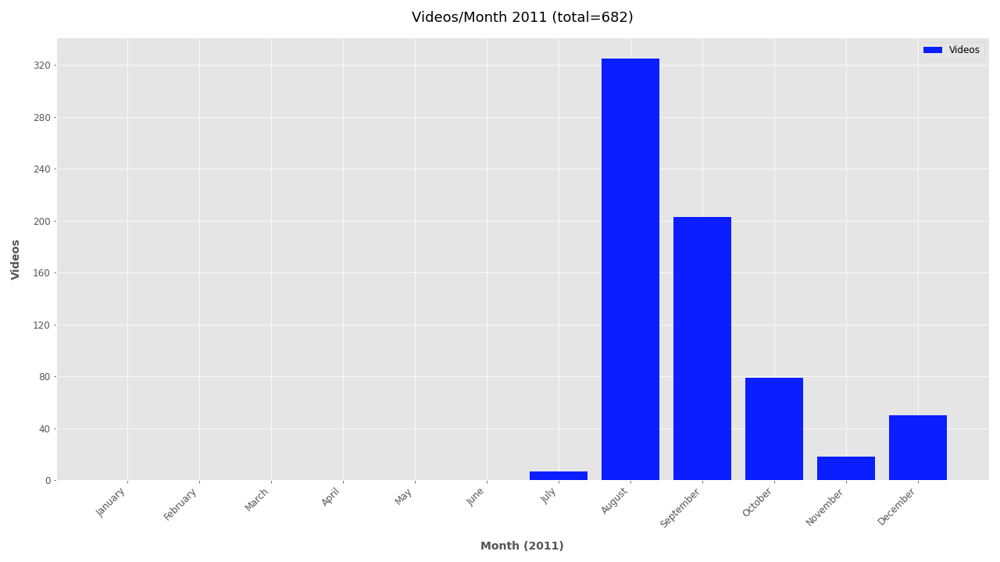
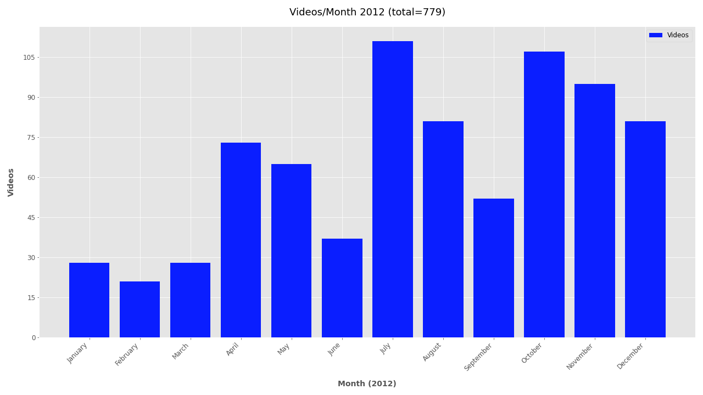
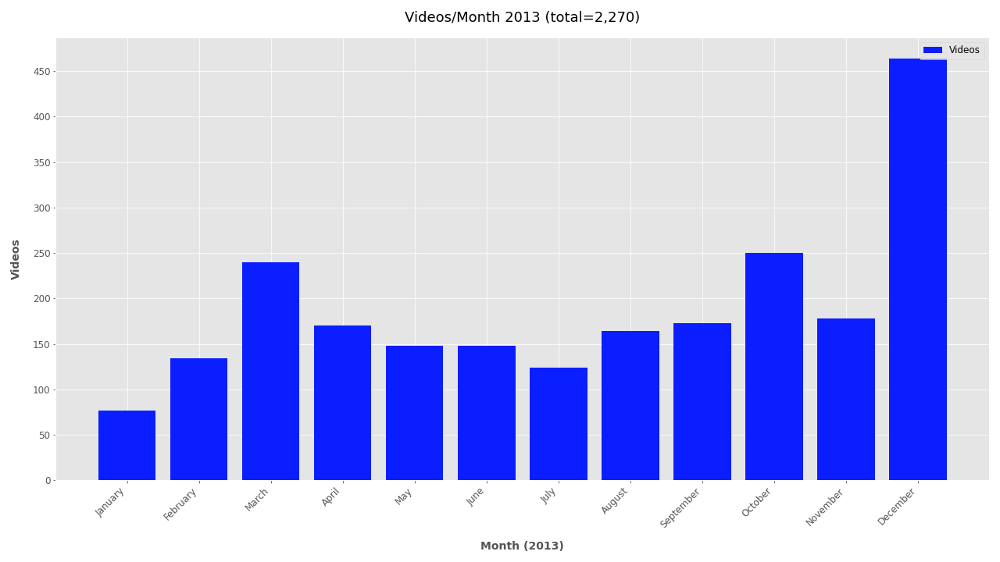
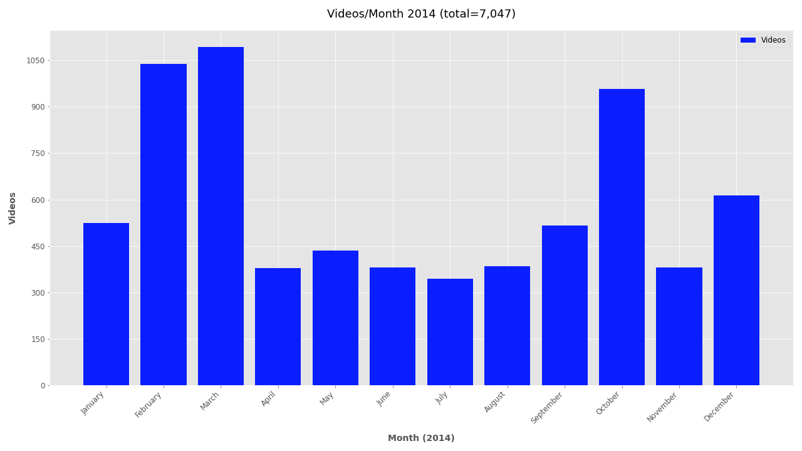
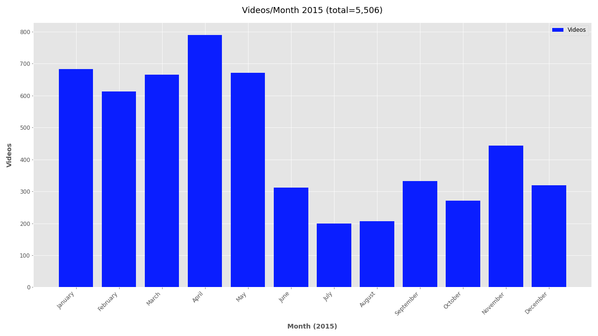
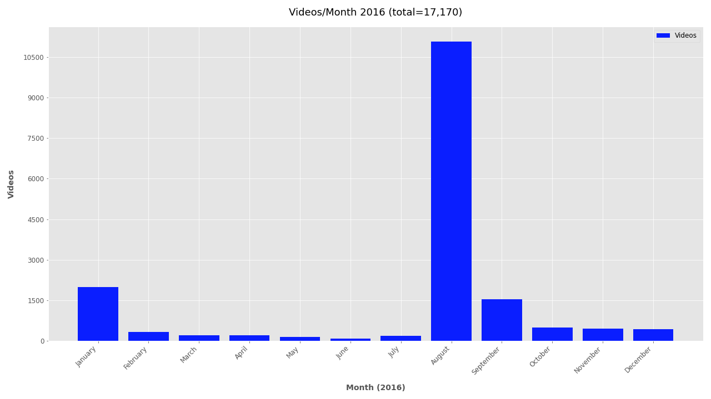

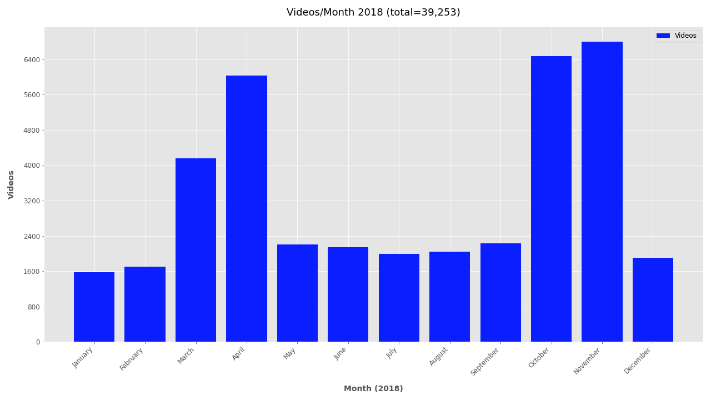
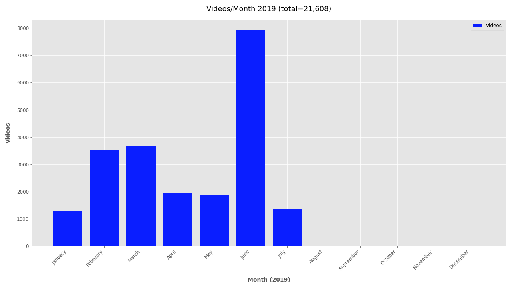

