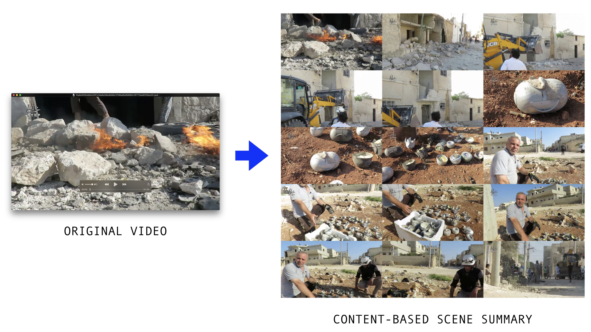
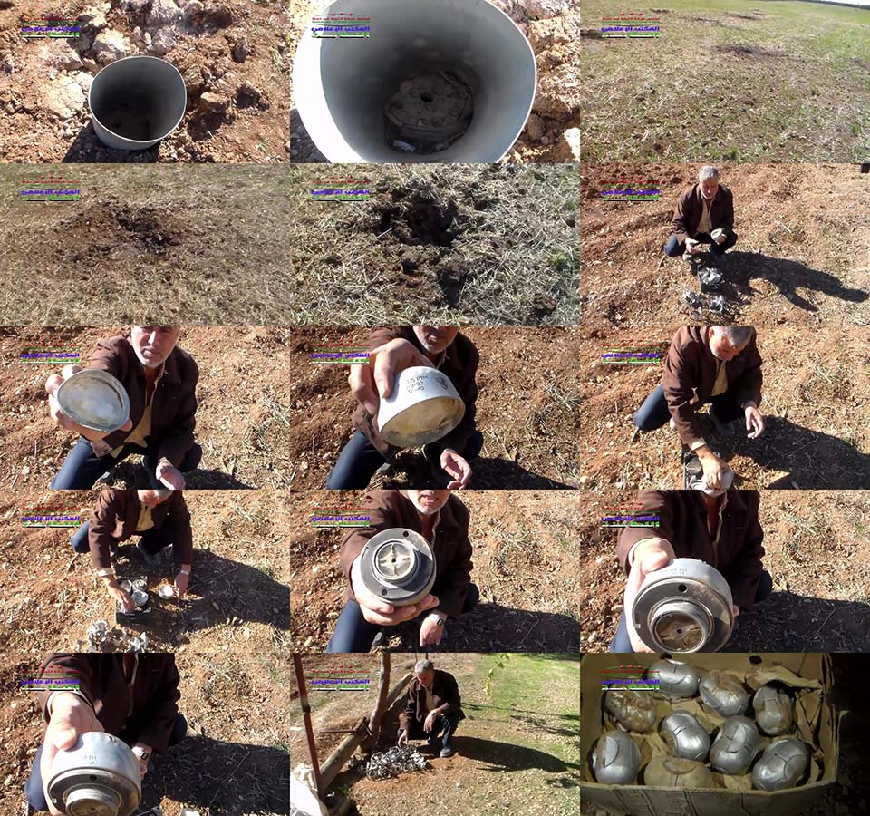
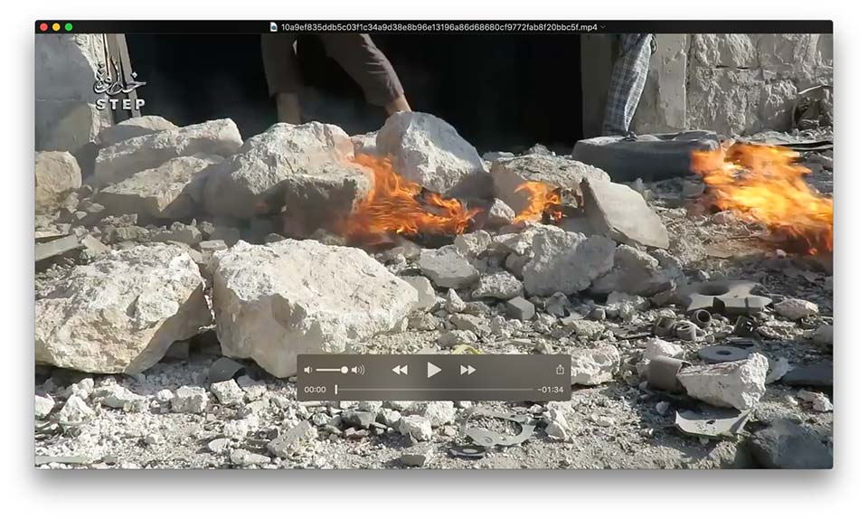



Scene summarization, as its name implies, summarizes the scenes of video into its most representative frames, acting as a *content compression* algorithm. But what exactly is a "scene"?

Consider the following scenario: a typical video in the Syrian Archive's collection is around 2.5 minutes long at 29.97 FPS, or about 4,500 frames per video. The Syrian Archive has over 3,314,000 videos or roughly 15 billion video frames that need to be analyzed. But the average speed of object detection algorithms is around 30FPS and the maximum number of usable processing threads per workstation is 4 (due to disk I/O and CPU/GPU resources). Analyzing 15 billion frames at 30FPS on a single computer in a multi-threaded system would therefore take 5,787 days or 15 years on a single thread or about 3 years on a maxed-out parallelized workstation. How is it even possible to analyze this many videos? Faster object detection algorithms? Better hardware? More computers? More parallelization? This is where scene summarization can help.

**Over 99% percent of these 15 billion frames can be ignored using scene summarization to omit similar video frames**.

Existing open source scene summarization and detection tools found during research rely on techniques such as measuring changes in color and brightness to detect changes in a *scene*. PySceneDetect's [*content-aware* scene detection](https://pyscenedetect.readthedocs.io/en/latest/features/#features-in-current-release) actually analyzes video "based on changes between frames in the HSV color space". Since color and brightness do not always indicate a change in content, a better approach is to use a convolutional neural network (CNN) feature vector that analyzes the frame based on the objects it contains. However, this process can be slow. To speed up feature extraction, the perceptual hash can be precomputed to determine when there is enough change between frames. Furthermore, the percpetual hash can be sped up by first using canny edge filtering to drop frames without any edge content. And this can be sped up even more by resizing the video frame down to about 160 pixels wide. Altogether this approach has been used at VFRAME to summarize over 2 million videos on a single workstation using a Python image processing workflow.

Since the scene-summarized keyframes represent (theoretically) all different views and scenes in the video, object detection can now be run on only those frames. The scene summarization includes 3 levels of density: short, medium, and expanded. The short includes the most diverse 15 frames, while the expanded includes approximately 10 to 100 frames. Once the videos are summarized, the expanded set is run through object detection and now only takes 1 to 3 seconds per video. To be thorough, videos with object detection matches from the summarized keyframes can then be analyzed frame-by-frame to track and estimate the number of unique objects.

As new object detection models are trained, the pre-computed set of keyframes are used again to check for evidence of illegal munitions. The runtime to analyze the entire corpus is now only about 11 days on a single workstation, instead of 3 years. Other techniques are also used to further reduce this time, including skipping videos with resolutions or durations below a certain threshold, or videos that have already been marked as containing evidence. Overall, with tweaks, batch processing the entire archive takes about 8 days on a single workstation.

Scene summarization is a important technique for working with large datasets. Often, most the video data is not useful and can be ignored. Pairing CNN feature extractors with pre-computed perceptual hashes and canny edge filters can significantly improve the capabilities of small research teams to analyze millions of videos. 

VFRAME's approach to scene summarization is still under development, but is briefly outlined below:

- reduce size of frames to around 160px
- create a focal mask to ignore edge pixels and logo areas
- convert images to canny edge representation
- compute sum of the edge information, ignore frames with not enough edge information
- compute a perceptual hash and feature vector (VGG16) for each remaining frame
- threshold the difference between consecutive frames for perceptual hash and content-based feature vector
- de-duplicate non-neighboring scenes and limit total frames to around 50
- measure the velocity of change to find stable images within the scene and omit transition frames
- find the best quality image within each scene to reduce blur using canny edge representation to estimate sharpness quality
- calculate PCA components of feature vectors of remaining keyframe candidates
- K-Means cluster on PCA components to find 12-15 most representative frames of video
- Works best on videos around 1-5 minutes duration

In practice, the algorithm generates a group of images for each video that looks like the example below. Overall, the number of frames (and amount of data) has been reduced by over 99%, yet the video is still understandable. Researchers can use these images to quickly preview the video before watching it, which also helps reduce exposure to graphic and traumatic content.

| Video Duration | FPS | Number of Frames |Number of Summary Frames | Data Reduction |
| --- | --- |--- | --- | --- |
| 0:59 | 29.97 | 1,768 | 12 | 99.33% |
| 5:07 | 29.97 | 9,200 | 12 | 99.87% |
| 1:34 | 29.97 | 2,817 | 12 | 99.58% |

### Example 1

### Example 2

<small>This research has been supported by funding from PrototypeFund (DE).</small>
